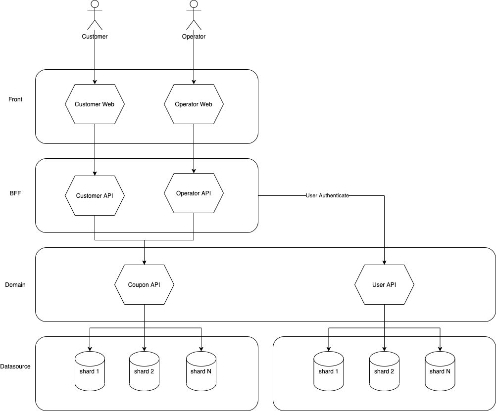

# Coupon Service API
This API is written in Kotlin/Java and using Spring stacks  
Please refer build.gradle.kts file for more details 

## How to run
### Run SpringBoot Fat Jar
```console
./gradlew bootJar
java -jar build/libs/book-api-<:version>>.jar
```

### Run Docker container
```console
./gradlew clean bootJar jibDockerBuild
docker run -p 8080:8080 -e "spring_profiles_active=<:profile_you_want_to_activate[local, dev, stg, prd]>" coupon-service-api
```

### Application information via http:<:host>:<:port>/actuator/info
ex) http:localhost:8080/actuator/info

### API specification via http:<:host>:<:port>/swagger-ui.html
ex) http:localhost:8080/swagger-ui.html

### Service Architecture (Production Env)
Front      tier : Frontend for each user types and may also devices
BFF        tier : BFF for each Frontend to differentiate authentication, authorization, audit and other requirements based on user type.
Domain     tier : Domain tier to control OLTP over a specific service
Datasource tier : Sharded Datasource for horizontal scalability



# Springboot Getting Started

### Reference Documentation
For further reference, please consider the following sections:

* [Official Gradle documentation](https://docs.gradle.org)
* [Spring Boot Gradle Plugin Reference Guide](https://docs.spring.io/spring-boot/docs/2.3.0.BUILD-SNAPSHOT/gradle-plugin/reference/html/)
* [Coroutines section of the Spring Framework Documentation](https://docs.spring.io/spring/docs/5.2.3.RELEASE/spring-framework-reference/languages.html#coroutines)
* [Spring Boot Actuator](https://docs.spring.io/spring-boot/docs/2.2.4.RELEASE/reference/htmlsingle/#production-ready)
* [Spring Data Elasticsearch (Access+Driver)](https://docs.spring.io/spring-boot/docs/2.2.4.RELEASE/reference/htmlsingle/#boot-features-elasticsearch)

### Guides
The following guides illustrate how to use some features concretely:

* [Building a RESTful Web Service with Spring Boot Actuator](https://spring.io/guides/gs/actuator-service/)

### Additional Links
These additional references should also help you:

* [Gradle Build Scans – insights for your project's build](https://scans.gradle.com#gradle)

